# Execution Workflow

이 문서는 execution phase의 Fleet Mode 흐름을 다이어그램 중심으로 설명한다.

상위 개념과 phase 전체 규칙은 [WORKFLOW-PLAYBOOK.md](WORKFLOW-PLAYBOOK.md)를 본다.

## 이 문서를 볼 때

- execution 진입 게이트를 한 번에 파악하고 싶을 때
- Commander 오케스트레이션, worker dispatch, review loop를 시각적으로 확인하고 싶을 때
- execution plan, review strategy, tail decision의 연결 순서를 확인하고 싶을 때

## Execution 흐름

```mermaid
flowchart TD
    Start(["execution 진입 요청"])
    Gate{"진입 조건이 준비되었는가"}
    Escalate["execution 진입 중단<br/>누락 artifact, user gate,<br/>planning 또는 downstream fix 요청"]
    Summary(["오케스트레이션 요약 반환<br/>진행률과 잔여 리스크 정리"])

    subgraph Commander["Commander 오케스트레이션"]
        Load["execution brief, approved PRD,<br/>downstream artifact 로드"]
        Scope["scope check 수행<br/>single plan 또는 split plans 판단"]
        Research{"추가 근거가 필요한가"}
        Augment["Explore 또는 Librarian 호출<br/>근거를 합성해 반영"]
        Map["file structure map 작성"]
        Plan["dependency-aware execution plan 작성<br/>/memories/session/execution-plan.md 저장"]
        Todo["todo 생성 또는 갱신<br/>review strategy 기록"]
        VerifyChoice{"plan verification 방식은 무엇인가"}
        CoordPlan["Coordinator execution review"]
        SelfCheck["Commander 자체 점검"]
        SkipCheck["추가 plan review 생략"]
        Gotchas["gotcha와 risk 식별<br/>필요하면 plan 갱신"]
        Blocker{"critical blocker,<br/>scope expansion,<br/>user choice 필요 여부"}
        Ready{"dispatch 가능한 task가 있는가"}
        Brief["implementation-ready brief 합성<br/>files/scope/done-definition/verification 잠금"]
        Dispatch["dependency wave 단위 dispatch<br/>implementation task_packet 전달"]
        Evidence["검증 evidence 회수<br/>commands/results/paths 정리"]
        Sync["worker 결과 합성<br/>todo와 execution-plan.md 갱신"]
        Drift{"drift 또는 확신 저하가 있는가"}
        CoordMid["선택적 Coordinator<br/>role-based review"]
        More{"남은 task가 있는가"}
        RefreshReview["changed surface와 verification evidence 기준으로<br/>review strategy 갱신"]
        GitNeed{"Git Tail이 필요한가"}
        GitTail["Commander가 Git Tail 결정<br/>실제 git action은 Deep Execution Agent 수행"]
        MemoryNeed{"Memory Tail이 필요한가"}
        MemoryTail["Commander가 Memory Tail 수행<br/>durable signal만 저장"]
    end

    subgraph Worker["Deep Execution Agent"]
        Implement["task_packet과 artifact를 읽고<br/>할당된 scope만 구현하며<br/>필수 verification 수행"]
    end

    subgraph Review["Reviewer Wave"]
        ReviewWave["review role 병렬 호출<br/>security, design,<br/>product-integrity, browser,<br/>performance, code-quality"]
        Board["최종 Reviewer board gate"]
        Verdict{"board verdict"}
        Rework["plan과 todo를 갱신하고<br/>targeted rework 할당"]
    end

    Start --> Gate
    Gate -- "아니오" --> Escalate --> Summary
    Gate -- "예" --> Load --> Scope --> Research
    Research -- "예" --> Augment --> Map
    Research -- "아니오" --> Map
    Map --> Plan --> Todo --> VerifyChoice
    VerifyChoice -- "Coordinator review" --> CoordPlan --> Gotchas
    VerifyChoice -- "self-check" --> SelfCheck --> Gotchas
    VerifyChoice -- "skip" --> SkipCheck --> Gotchas
    Gotchas --> Blocker
    Blocker -- "예" --> Escalate
    Blocker -- "아니오" --> Ready
    Ready -- "예" --> Brief --> Dispatch --> Implement --> Evidence --> Sync --> Drift
    Drift -- "예" --> CoordMid --> More
    Drift -- "아니오" --> More
    More -- "예" --> Ready
    More -- "아니오" --> RefreshReview --> ReviewWave --> Board --> Verdict
    Verdict -- "rework-required" --> Rework --> Implement
    Verdict -- "approve" --> GitNeed
    Verdict -- "approve-with-risks" --> GitNeed
    GitNeed -- "예" --> GitTail --> MemoryNeed
    GitNeed -- "아니오" --> MemoryNeed
    MemoryNeed -- "예" --> MemoryTail --> Summary
    MemoryNeed -- "아니오" --> Summary
```

## 읽는 법

- entry gate가 실패하면 execution에 들어가지 않고 artifact 보강, user gate 확보, planning 또는 downstream fix로 되돌아간다.
- Commander는 execution brief, approved PRD, downstream artifact를 읽고 execution-plan과 todo를 동기화한다.
- exact evidence field definition과 completeness 기준은 Deep Execution Agent의 `Verification`, Reviewer의 `Evidence`와 `Risks`가 owner고, 이 문서는 흐름만 요약한다.
- dispatch 전에는 latest findings를 implementation-ready brief로 합성하고, raw worker findings를 그대로 다음 worker에게 넘기지 않는다.
- 구현은 dependency wave 기준으로 Deep Execution Agent에 배분한다.
- worker 결과는 pass/fail 한 줄이 아니라 changed files, commands, observed results, skipped checks를 포함한 evidence로 회수한다.
- 구현 중 drift가 감지되면 Coordinator review를 중간에 다시 열 수 있다.
- wrong-approach retry는 fresh worker가 기본이고, local error-context correction은 continue가 기본이다.
- 구현이 끝나면 review role 병렬 검토 뒤 board gate로 최종 verdict를 닫는다.
- board verdict가 승인 가능 수준일 때만 Git Tail과 Memory Tail 판단으로 넘어간다.