# Planning Workflow

이 문서는 planning phase의 공통 루프와 Mate의 mode 분기를 다이어그램 중심으로 설명한다.

상위 개념과 phase 전체 규칙은 [WORKFLOW-PLAYBOOK.md](WORKFLOW-PLAYBOOK.md)를 본다.

## 이 문서를 볼 때

- planning entry, discovery, council, approval 흐름을 한 번에 파악하고 싶을 때
- Mate, Explore, Librarian, Coordinator의 역할 분담을 시각적으로 확인하고 싶을 때
- default와 heavy mode가 어디서 갈라지고 무엇이 다른지 확인하고 싶을 때

## Planning 흐름

```mermaid
flowchart TD
    Start(["planning 진입 요청"])
    Entry["user request와 current session artifact 확인"]
    Mode{"mode가 명시되었는가"}
    ExplicitMode{"명시된 mode는 무엇인가"}
    SelectMode["askQuestions로 default 또는 heavy 선택"]
    SelectedMode{"선택된 mode는 무엇인가"}
    DefaultMode["default mode 활성화"]
    HeavyMode["heavy mode 활성화"]
    ActiveMode{"활성 planning mode"}

    subgraph Shared["공통 Planning 루프"]
        Discover["가까운 skill, reference,<br/>reusable pattern, project rule 확인"]
        Clarify{"문제, 사용자, scope,<br/>metric, non-goal이 흐린가"}
        Ask["askQuestions로 alignment 또는 steering 수행"]
        Evidence{"context gap, evidence gap,<br/>reference need가 있는가"}
        ExploreLane["Explore로 local evidence 수집"]
        LibrarianLane["Librarian로 external evidence 수집"]
        ReferenceSync["decision-ready evidence를<br/>references.md에 반영"]
        Ears["EARS 다차원 커버리지 점검<br/>functional, visual-design, UX, technical, content"]
        Draft["PRD-TEMPLATE 기준으로 prd.md 작성"]
        Council["Coordinator lane 최소 2개 오픈<br/>role별 council review 수행"]
        Verdict{"Coordinator verdict"}
        Refine["prd.md와 references.md를 수정하고<br/>invalidated lane만 다시 연다"]
        Gate["planning quality gate 평가"]
        Pass{"quality gate 통과 여부"}
        Brief["approved PRD briefing 제시"]
    end

    subgraph Default["Default Mode 분기"]
        DefaultDecision["user에게 추가 refinement 여부와<br/>downstream mode를 askQuestions로 회수"]
        DefaultModePick{"downstream mode"}
        DefaultDesign["Designer 진입"]
        DefaultTechPrep{"technical seed가 충분한가"}
        DefaultResearch["clarification 또는 research lane 재오픈"]
        DefaultTech["Architector 진입"]
        DefaultBoth["Designer와 Architector 진입"]
        DefaultSync["latest approved artifact 동기화 후 종료"]
    end

    subgraph Heavy["Heavy Mode 분기"]
        HeavyDecision["Mate가 downstream mode를 스스로 결정"]
        HeavyModePick{"결정된 mode"}
        HeavyDesign["Designer 먼저 진입"]
        PostDesign["generated design.md를<br/>PRD, references, coordinator finding 기준으로 재검토"]
        HeavyDesignOk{"design lane이 유효한가"}
        HeavyTechNeed{"technical lane이 정말 필요한가"}
        HeavyTechPrep{"technical seed가 충분한가"}
        HeavyResearch["targeted digging 또는 clarification 재오픈"]
        HeavyTech["Architector 진입"]
        PostTech["generated technical.md를<br/>PRD, references, approved design 기준으로 재검토"]
        HeavyTechOk{"technical lane이 유효한가"}
        HeavySync["latest approved artifact 동기화 후 종료"]
    end

    End(["planning 종료 또는 downstream handoff 준비"])

    Start --> Entry --> Mode
    Mode -- "예" --> ExplicitMode
    Mode -- "아니오" --> SelectMode --> SelectedMode
    ExplicitMode -- "default" --> DefaultMode
    ExplicitMode -- "heavy" --> HeavyMode
    SelectedMode -- "default" --> DefaultMode
    SelectedMode -- "heavy" --> HeavyMode

    DefaultMode --> Discover
    HeavyMode --> Discover
    Discover --> Clarify
    Clarify -- "예" --> Ask --> Evidence
    Clarify -- "아니오" --> Evidence
    Evidence -- "예" --> ExploreLane --> ReferenceSync
    Evidence -- "병렬 external 필요" --> LibrarianLane --> ReferenceSync
    Evidence -- "아니오" --> Ears
    ReferenceSync --> Ears --> Draft --> Council --> Verdict
    Verdict -- "green" --> Gate
    Verdict -- "yellow" --> Refine --> Discover
    Verdict -- "red" --> Refine --> Discover
    Gate --> Pass
    Pass -- "통과" --> Brief
    Pass -- "미통과" --> Refine --> Discover

    Brief --> ActiveMode
    ActiveMode -- "default" --> DefaultDecision
    ActiveMode -- "heavy" --> HeavyDecision

    DefaultDecision --> DefaultModePick
    DefaultModePick -- "디자인만" --> DefaultDesign --> DefaultSync --> End
    DefaultModePick -- "기술설계만" --> DefaultTechPrep
    DefaultTechPrep -- "예" --> DefaultTech --> DefaultSync --> End
    DefaultTechPrep -- "아니오" --> DefaultResearch --> DefaultTech
    DefaultModePick -- "둘 다" --> DefaultBoth --> DefaultSync --> End

    HeavyDecision --> HeavyModePick
    HeavyModePick -- "디자인만" --> HeavyDesign --> PostDesign --> HeavyDesignOk
    HeavyModePick -- "기술설계만" --> HeavyTechPrep
    HeavyModePick -- "둘 다" --> HeavyDesign --> PostDesign --> HeavyDesignOk
    HeavyDesignOk -- "아니오" --> Refine
    HeavyDesignOk -- "예" --> HeavyTechNeed
    HeavyTechNeed -- "아니오" --> HeavySync --> End
    HeavyTechNeed -- "예" --> HeavyTechPrep
    HeavyTechPrep -- "예" --> HeavyTech --> PostTech --> HeavyTechOk
    HeavyTechPrep -- "아니오" --> HeavyResearch --> HeavyTech
    HeavyTechOk -- "아니오" --> Refine
    HeavyTechOk -- "예" --> HeavySync --> End
```

## Mode 차이 핵심

| 항목 | default | heavy |
| --- | --- | --- |
| mode 결정 | user 명시 또는 askQuestions | user 명시 또는 askQuestions |
| 조사 강도 | 필요한 범위의 discovery | evidence closure 중심의 깊은 digging |
| coordinator 기준 | 최소 2개 lane, gate 통과 중심 | 최소 2개 lane, 열린 lane 전부 green 필요 |
| planning quality gate | total 88 이상, critical blocker 없음, explicit user alignment 필요 | total 95 이상, opened lane all green, evidence gap bounded 필요 |
| downstream mode 결정 | user가 askQuestions로 선택 | Mate가 스스로 결정 |
| downstream 순서 | 디자인과 기술설계를 바로 열 수 있음 | design-first, post-design review 뒤 technical entry 재판단 |

## 읽는 법

- planning은 항상 Mate가 primary owner이며, Explore, Librarian, Coordinator는 support lane으로 붙는다.
- 공통 루프는 discovery, 질문, evidence 수집, EARS 점검, PRD drafting, council review, refinement, quality gate 순서로 돈다.
- default는 user alignment와 downstream mode 회수가 planning 종료 직전의 중요한 게이트다.
- heavy는 digging과 council 기준이 더 강하고, downstream lane도 design-first 순서로 다시 검토한다.
- 두 mode 모두 approved PRD가 준비되기 전에는 execution으로 넘어가지 않는다.

## 산출물

- prd.md
- references.md
- optional notepad.md
- approved PRD briefing
- 필요 시 design.md 또는 technical.md로 이어지는 guided handoff