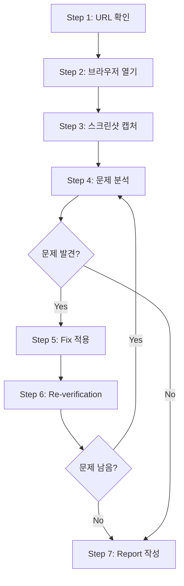

# Inspection Workflow

실제 브라우저에서 실행되는 웹사이트의 visual inspection workflow를 다룬다.

---

## Workflow Overview



---

## Step 1: URL 확인

### URL이 제공되지 않았을 때

사용자에게 URL을 요청한다:

> 검수할 웹사이트 URL을 제공해주세요 (예: `http://localhost:3000`)

### URL이 제공되었을 때

URL을 확인하고 접근 가능성을 검증한다:
- Local development server (`http://localhost:PORT`)
- Staging environment
- Production environment (read-only review)

---

## Step 2: 브라우저 열기

### Browser Tools 사용

`open_browser_page` tool로 브라우저를 열고 page ID를 반환받는다:

```
open_browser_page(url: "http://localhost:3000")
→ pageId: "page-123"
```

### agent-browser 스킬 사용

`agent-browser` 스킬이 더 복잡한 browser operation을 제공한다. 필요 시 해당 스킬을 로드하여 사용한다.

---

## Step 3: 스크린샷 캡처

### 전체 페이지 스크린샷

`screenshot_page` tool로 전체 viewport를 캡처한다:

```
screenshot_page(pageId: "page-123")
```

### 부분 스크린샷

문제 영역을 selector로 지정하여 부분 캡처:

```
screenshot_page(pageId: "page-123", selector: ".card-container")
```

### Viewport 테스트

다양한 viewport에서 스크린샷을 캡처한다:

| Viewport | Width | 대표 Device |
|----------|-------|-------------|
| Mobile | 375px | iPhone SE/12 mini |
| Tablet | 768px | iPad |
| Desktop | 1280px | Standard PC |
| Wide | 1920px | Large display |

Viewport 전환은 browser DevTools 또는 Playwright viewport 설정을 사용한다.

---

## Step 4: 문제 분석

### DOM 정보 수집

`read_page` tool로 DOM snapshot을 수집한다:

```
read_page(pageId: "page-123")
```

### 문제 분류

발견된 문제를 severity로 분류한다:

| Priority | Category | Examples |
|----------|----------|----------|
| P0 (Critical) | Functionality breaking | Complete element overlap, content disappearance |
| P1 (High) | Serious UX issues | Unreadable text, inoperable buttons |
| P2 (Medium) | Moderate issues | Alignment issues, spacing inconsistencies |
| P3 (Low) | Minor issues | Slight positioning differences, minor color variations |

### 문제 위치 파악

문제 요소의 selector, component path, style file을 식별한다:

1. **Selector-based Search**
   - class name 또는 ID로 코드 검색 (`grep_search`)
   - element text로 component 식별 (`semantic_search`)

2. **File Pattern Filtering**
   - Style files: `src/**/*.css`, `styles/**/*`
   - Components: `src/components/**/*`
   - Pages: `src/pages/**`, `app/**`

---

## Step 5: Fix 적용

### Framework-specific Fix

프로젝트의 styling method에 맞는 fix pattern을 적용한다. 상세는 [03-framework-fixes.md](03-framework-fixes.md)를 참조한다.

### Fix 원칙

1. **Minimal Changes**: 문제를 해결하는 최소한의 변경만 적용한다
2. **Respect Existing Patterns**: 프로젝트의 기존 code style을 따른다
3. **Avoid Breaking Changes**: 다른 영역에 side effect를 주지 않도록 주의한다
4. **Add Comments**: fix의 이유를 설명하는 comment를 추가한다

---

## Step 6: Re-verification

### Fix 후 확인

1. 페이지 reload 또는 HMR wait
2. 문제 영역 재스크린샷
3. Before/After 비교

### Regression Testing

- Fix가 다른 영역에 영향을 주지 않았는지 확인한다
- 다른 viewport에서 문제가 발생하지 않는지 확인한다

### Iteration Limit

특정 문제에 3회 이상 fix attempt가 필요하면 사용자에게 consult한다.

---

## Step 7: Report 작성

### Inspection Report Template

```markdown
# Visual Inspection Report

## Summary
| 항목 | 값 |
|------|-----|
| Target URL | {URL} |
| Viewports Tested | Desktop, Tablet, Mobile |
| Framework | {Detected framework} |
| Styling Method | {CSS / Tailwind / etc.} |
| Issues Detected | {N} |
| Issues Fixed | {M} |

## Detected Issues

### [P1] {Issue Title}
- **Location**: {selector or component path}
- **Viewport**: {problematic viewport}
- **Evidence**: 스크린샷 참조
- **Severity**: High
- **Fix Applied**: {description of fix}

## Verification
- Before/After 스크린샷 비교
- Regression check 결과
```

---

## Tool Sequence 예시

```
1. open_browser_page(url) → pageId
2. screenshot_page(pageId) → 전체 스크린샷
3. read_page(pageId) → DOM snapshot
4. grep_search(selector) → source file 찾기
5. read_file(sourceFile) → 코드 확인
6. replace_string_in_file → fix 적용
7. screenshot_page(pageId) → re-verification
8. read_page(pageId) → DOM 재확인
9. Report 작성
```