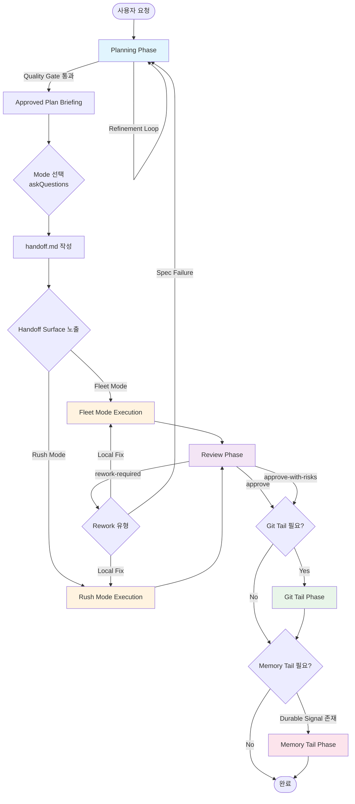
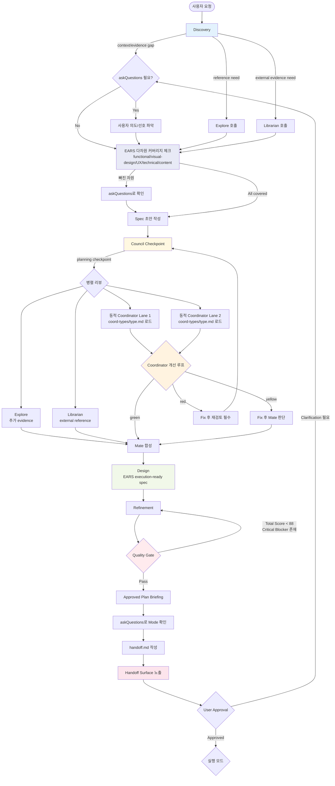
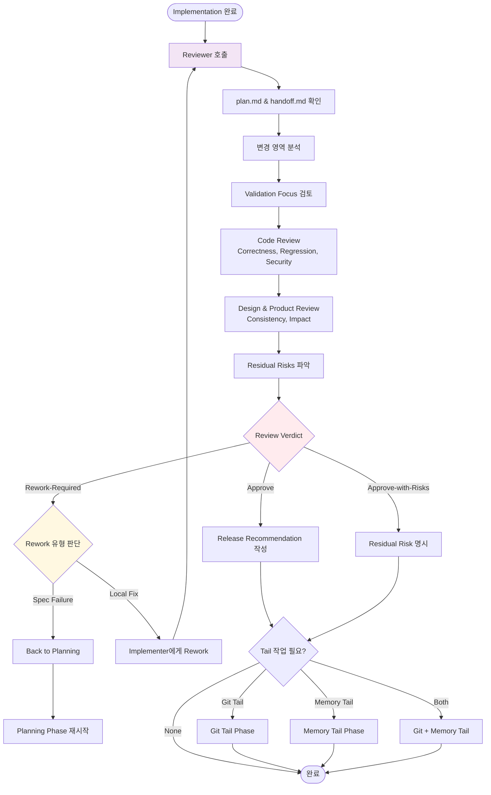
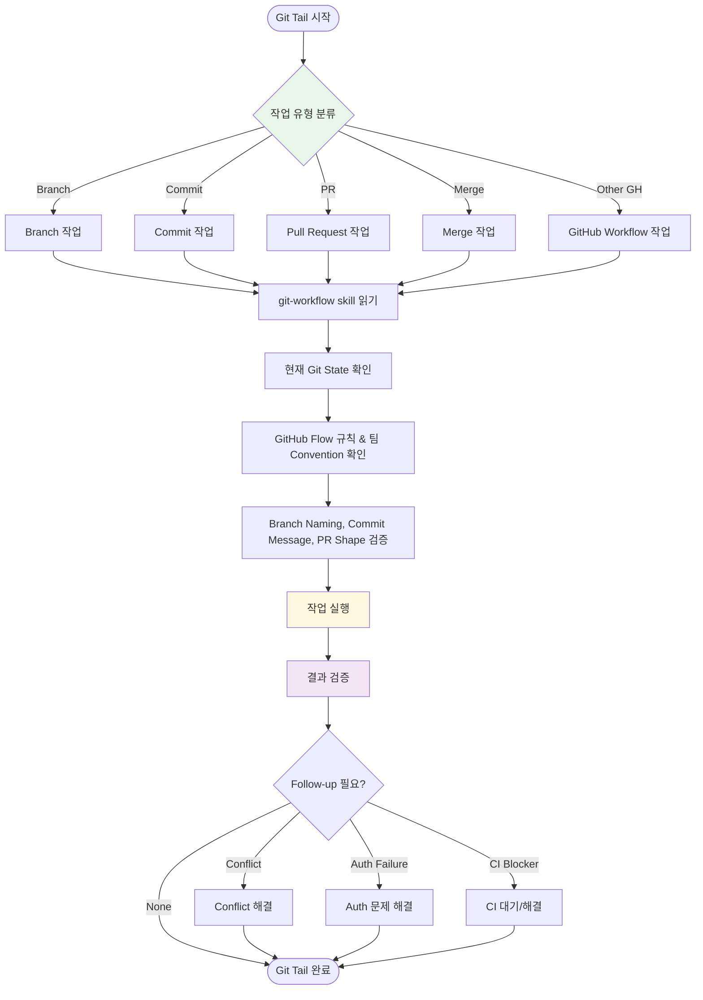
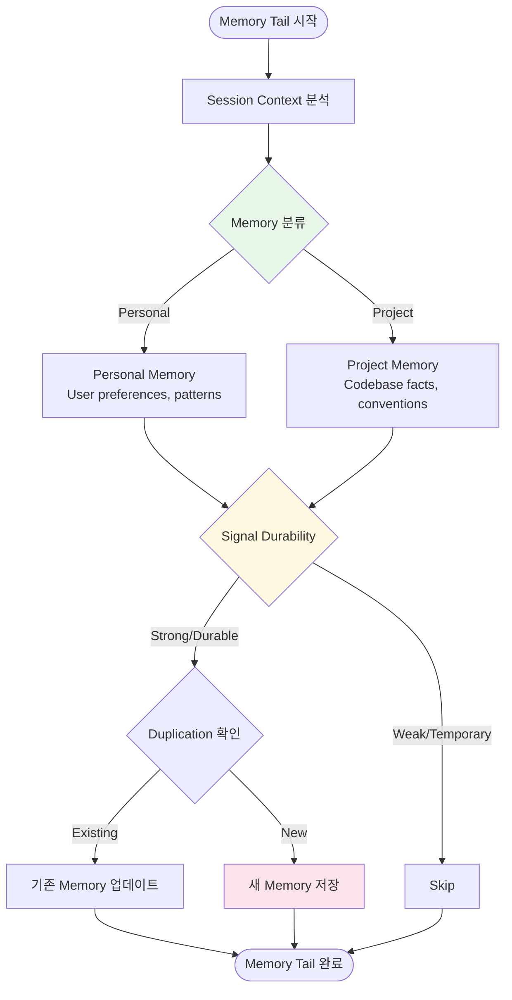
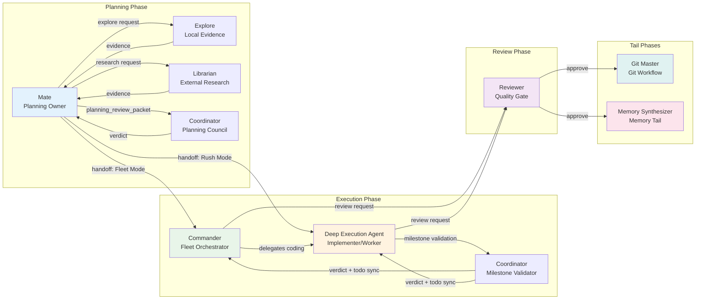
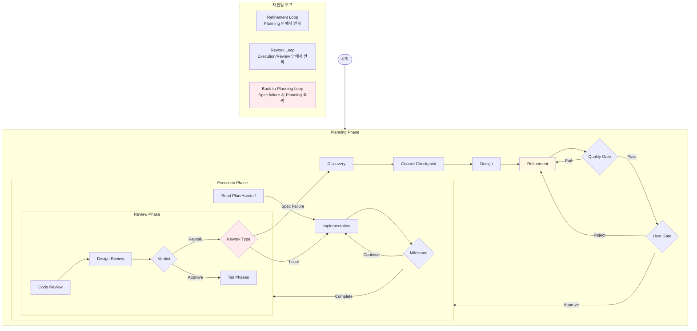
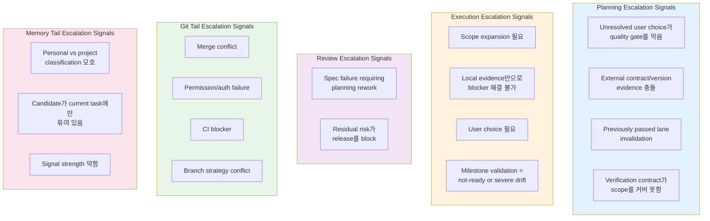

# 메이트 워크플로우 시각화

이 문서는 [product-workflow.instructions.md](.github/instructions/product-workflow.instructions.md)의 워크플로우를 Mermaid 다이어그램으로 시각화한다.

---

## 1. 전체 워크플로우 개요

### Phase 전환 조건

| From | To | Entry Conditions |
|------|-----|------------------|
| Planning | Execution | approved plan, passed coordinator-reviewed quality gate, mode confirmed, handoff.md 완성, explicit user approval |
| Execution | Review | implementation 결과와 verification evidence 준비 |
| Review | Git Tail | review verdict가 승인 가능 수준 |
| Review | Memory Tail | validated work나 반복 가치가 있는 signal 존재 |
| Review | Planning | spec-level failure로 local fix로 덮으면 안 되는 경우 |

---

## 2. Planning Phase 상세

### Planning Quality Gate 조건

- Total Score 88 이상
- Critical Blocker 없음
- Latest revision이 coordinator-reviewed 상태
- Pass 후 askQuestions로 Mode 확인 → `handoff.md` 작성 → handoff surface 노출

---

## 3. Execution Phase 상세

### Execution Entry Conditions

1. Approved `plan.md`가 존재
2. Explicit user approval이 있음
3. Current `handoff.md`가 있음
4. Required planning lanes가 invalidated 상태가 아님

```mermaid
flowchart TB
    Start([Execution 시작]) --> ReadPlan[plan.md & handoff.md 읽기]
    
    ReadPlan --> Mode{실행 모드}
    
    Mode -->|Fleet Mode| Commander[Commander<br/>Orchestration Owner]
    Mode -->|Rush Mode| DeepAgent[Deep Execution Agent<br/>Single Implementer]
    
    %% Fleet Mode Flow
    Commander --> FleetStrategy[Execution Strategy 확정]
    FleetStrategy --> FleetContext{Context 보강 필요?}
    
    FleetContext -->|Yes| FleetExplore[Explore/Librarian 호출]
    FleetContext -->|No| WorkSplit
    
    FleetExplore --> WorkSplit[Work Unit Split/Merge]
    
    WorkSplit --> WorkerAssign[Deep Execution Agent Worker<br/>Coding Work 위임]
    
    WorkerAssign --> FleetMilestone{Major Milestone}
    
    FleetMilestone -->|No| WorkerAssign
    FleetMilestone -->|Yes| FleetCoordCheck[Coordinator Validation 요청]
    
    FleetCoordCheck --> FleetCoordVerdict{Coordinator Verdict}
    
    FleetCoordVerdict -->|Not Ready| FleetStrategy
    FleetCoordVerdict -->|Ready| FleetTodoSync[Todo Sync]
    
    FleetTodoSync --> FleetComplete{Implementation 완료?}
    
    FleetComplete -->|No| WorkerAssign
    FleetComplete -->|Yes| FleetReview[Reviewer Broad Review]
    
    %% Rush Mode Flow
    DeepAgent --> RushContext{Context 보강 필요?}
    
    RushContext -->|Yes| RushExplore[Explore/Librarian 호출]
    RushContext -->|No| RushImpl
    
    RushExplore --> RushImpl[직접 구현]
    
    RushImpl --> RushMilestone{Major Milestone}
    
    RushMilestone -->|No| RushImpl
    RushMilestone -->|Yes| RushCoordCheck[Coordinator Validation 요청]
    
    RushCoordCheck --> RushCoordVerdict{Coordinator Verdict}
    
    RushCoordVerdict -->|Not Ready| RushImpl
    RushCoordVerdict -->|Ready| RushTodoSync[Todo Sync]
    
    RushTodoSync --> RushComplete{Implementation 완료?}
    
    RushComplete -->|No| RushImpl
    RushComplete -->|Yes| RushReview[Reviewer Broad Review]
    
    %% Review 결과
    FleetReview --> ReviewResult{Review Verdict}
    RushReview --> ReviewResult
    
    ReviewResult -->|Rework Required| ReworkType{Rework 유형}
    
    ReworkType -->|Fleet| WorkerAssign
    ReworkType -->|Rush| RushImpl
    
    ReviewResult -->|Approve| Tail{Tail 필요?}
    
    Tail --> Git
    Tail --> Memory
    
    style Commander fill:#e8f5e9
    style DeepAgent fill:#fff3e0
    style FleetCoordCheck fill:#f3e5f5
    style RushCoordCheck fill:#f3e5f5
```

### Execution Mode 선택 기준

| Mode | Owner | 언제 선택 |
|------|-------|----------|
| Fleet Mode | Commander | Split/Merge orchestration이 품질에 의미 있게 도움이 될 때 |
| Rush Mode | Deep Execution Agent | Context continuity와 단일 implementer 흐름이 유리할 때 |

---

## 4. Review Phase 상세

### Review Outcomes

| Verdict | 의미 | 다음 단계 |
|---------|------|----------|
| `approve` | 승인 가능, residual risk 없음 | Git/Memory Tail 진행 |
| `approve-with-risks` | 승인 가능하지만 residual risk 존재 | Risk 명시 후 Tail 진행 |
| `rework-required` | 수정 필요 | Implementer rework 또는 back-to-planning |

---

## 5. Git Tail Phase 상세

### Git Tail Entry Conditions

1. Implementation과 review가 git workflow action을 할 정도로 validated됨
2. Review가 통과했거나 explicit exception이 승인됨

### Git Tail Guardrails

- `main`에 직접 커밋하지 않는다
- 작업 전에 현재 상태를 확인한다
- 가능하면 커밋 전에 diff를 다시 본다
- 팀 convention과 GitHub Flow를 어기지 않는다

---

## 6. Memory Tail Phase 상세

### Memory Synthesizer Authority

`Memory-synthesizer`는 durable signal이 충분하면 **사용자 확인 없이 저장**할 수 있다.

### Memory Tail Guardrails

- Secret, credential, sensitive data를 저장하지 않는다
- Temporary task state를 durable memory로 저장하지 않는다
- Low-confidence write보다 skip를 우선한다
- Memory pollution과 duplication을 피한다

---

## 7. 역할별 책임과 상호작용

### 역할별 Owner 책임

| Role | Phase | 책임 |
|------|-------|------|
| **Mate** | Planning | User intent를 execution-ready spec으로 변환, planning loop 주도 |
| **Coordinator** | Planning, Execution | Planning council 검토, milestone validation, todo sync |
| **Commander** | Execution (Fleet) | Fleet Mode orchestration, worker 관리, review orchestration |
| **Deep Execution Agent** | Execution | Rush Mode primary implementer, Fleet Mode coding worker |
| **Reviewer** | Review | Broad quality gate, correctness/security/design/product 검토 |
| **Git Master** | Git Tail | Validated change를 GitHub Flow에 맞게 정리 |
| **Memory Synthesizer** | Memory Tail | Durable signal만 memory에 저장 |
| **Explore** | Support | Local evidence, reusable pattern, symbol flow 탐색 |
| **Librarian** | Support | Official docs, external research, version 검증 |

---

## 8. 재진입 루프 상세

### 루프 발생 조건

| 루프 | 발생 조건 | 범위 |
|------|----------|------|
| **Refinement Loop** | Quality gate 미통과, user feedback, new evidence | Planning Phase 내부 |
| **Rework Loop** | Review verdict = rework-required | Execution ↔ Review |
| **Back-to-Planning** | Spec-level failure, scope expansion 필요 | Review → Planning |

---

## 9. Quality Gate 체크리스트

```mermaid
flowchart TB
    subgraph PlanningGate[Planning Quality Gate - 통과 조건]
        PG1[Total Score ≥ 88]
        PG2[No Critical Blocker]
        PG3[Coordinator-Reviewed]
        
        PG1 --> PG2 --> PG3
    end
    
    subgraph PostGateActions[Post-Gate Actions]
        PGA1[handoff.md 생성/갱신]
        PGA2[User Approval]
        
        PGA1 --> PGA2
    end
    
    subgraph ExecutionGate[Execution Quality Gate]
        EG1[Milestone Validation = Ready]
        EG2[Todo Sync 최신 상태]
        EG3[Verification Completeness]
        
        EG1 --> EG2 --> EG3
    end
    
    subgraph ReviewGate[Review Quality Gate]
        RG1[Verdict = Approve/approve-with-risks]
        RG2[Residual Risk 명시]
        RG3[Release Recommendation]
        
        RG1 --> RG2 --> RG3
    end
    
    subgraph GitGate[Git Tail Quality Gate]
        GG1[Workflow Safety]
        GG2[Rule Compliance]
        
        GG1 --> GG2
    end
    
    subgraph MemoryGate[Memory Tail Quality Gate]
        MG1[Durable Signal 충분]
        MG2[Duplication Avoidance]
        
        MG1 --> MG2
    end
    
    style PlanningGate fill:#e3f2fd
    style ExecutionGate fill:#fff3e0
    style ReviewGate fill:#f3e5f5
    style GitGate fill:#e8f5e9
    style MemoryGate fill:#fce4ec
```

---

## 10. 에스컬레이션 시그널

---

## 참조

- [product-workflow.instructions.md](.github/instructions/product-workflow.instructions.md) — 워크플로우 상세 정의
- [subagent-invocation.instructions.md](.github/instructions/subagent-invocation.instructions.md) — 서브에이전트 호출 계약
- [AGENTS.md](AGENTS.md) — 전역 불변식과 역할 경계
