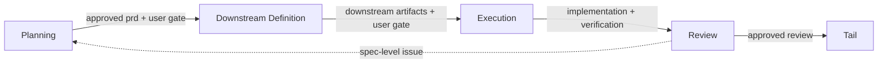

<div align="center">

# Copilot Agent Harness

VS Code Copilot Chat Agent Mode를
작업 가능한 제품 개발 워크플로우로 바꾸기 위한 보일러플레이트

</div>

이 저장소는 단순한 프롬프트 모음이 아닙니다. 기획, 설계, 구현, 리뷰를 서로 다른 단계와 역할로 분리하고, 그 과정에서 필요한 문서, 지침, 스킬, 레퍼런스를 함께 제공합니다.

프로젝트에 그대로 복사해 시작해도 되고, 팀 방식에 맞게 일부만 가져가도 됩니다.

> Last reviewed: 2026-03-19

---

## 한눈에 보기

- 승인된 PRD 없이 구현으로 넘어가지 않도록 phase와 gate를 둡니다.
- 역할이 다른 agent를 분리해 한 에이전트가 모든 결정을 떠안지 않게 만듭니다.
- instruction, skill, reference를 함께 제공해 추측보다 조회를 먼저 하게 만듭니다.
- 사람이 다시 읽고 판단할 수 있는 산출물을 남기도록 설계되어 있습니다.

## 이런 경우에 맞습니다

- Copilot Chat을 단발성 코드 생성기보다 작업 시스템에 가깝게 쓰고 싶은 팀
- 요구사항 정리, 설계, 구현, 리뷰를 한 대화 안에서 섞지 않고 나누고 싶은 개인
- agent, instruction, skill 파일을 처음부터 설계하기보다 기본 틀에서 시작하고 싶은 경우

## 핵심 원칙

### Retrieval-led reasoning

판단 전에 코드베이스, 문서, 레퍼런스를 먼저 조회합니다. 이 하네스는 "아는 척"보다 근거를 우선합니다.

### Explicit gates

기획 산출물과 사용자 승인 없이 다음 단계로 넘어가지 않습니다. 특히 승인된 `prd.md`가 없으면 구현을 열지 않는 점이 핵심입니다.

### Evidence-first review

중요한 결론은 역할별 리뷰와 evidence를 거칩니다. 근거가 부족하면 더 강한 주장 대신 더 나은 조회를 선택합니다.

### Human-readable artifacts

채팅 로그에만 의존하지 않고 사람이 다시 읽을 수 있는 산출물을 남깁니다. `prd.md`, `design.md`, `technical.md`, `execution-plan.md`가 그 중심입니다.

## 워크플로우

이 하네스는 5단계로 움직입니다.

| Phase | Owner | 주요 결과물 | 다음 단계로 가는 조건 |
|:---|:---|:---|:---|
| Planning | Mate | `prd.md`, `references.md` | PRD 승인, 품질 검토, 사용자 정렬 |
| Downstream Definition | Designer / Architector | `design.md`, `technical.md` | 산출물 준비, 사용자 게이트 통과 |
| Execution | Commander → Deep Execution Agent | 구현 코드, `execution-plan.md`, 검증 결과 | 구현 및 verification evidence 확보 |
| Review | Reviewer | 역할별 findings, board verdict | 승인 가능한 수준의 review verdict |
| Tail | 현재 owner | git 작업, memory 정리 | review 이후에만 진입 |



더 자세한 규칙은 [AGENTS.md](AGENTS.md)와 [.github/instructions/subagent-invocation.instructions.md](.github/instructions/subagent-invocation.instructions.md)를 보면 됩니다.

## 포함된 agent

### Core

| Agent | 하는 일 |
|:---|:---|
| Mate | 요구사항을 정리하고 `prd.md`와 `references.md`를 만든다 |
| Designer | 승인된 PRD를 바탕으로 `design.md`를 만든다 |
| Architector | 승인된 PRD를 기술 설계 문서로 확장한다 |
| Commander | 실행 계획을 세우고 구현 작업을 오케스트레이션한다 |
| Deep Execution Agent | 구현과 검증을 실제로 수행한다 |
| Reviewer | 코드, 보안, 성능, 디자인 관점에서 결과를 검토한다 |

### Support

| Agent | 쓰는 시점 |
|:---|:---|
| Explore | 로컬 코드베이스에서 패턴과 근거를 찾을 때 |
| Librarian | 공식 문서나 외부 레퍼런스가 필요할 때 |
| Coordinator | 방향성 검토나 role-based council이 필요할 때 |
| Painter | 디자인 맥락 기반으로 비주얼 에셋을 만들 때 |

자세한 정의는 [.github/agents/](.github/agents/) 아래 파일에 정리되어 있습니다.

## 스킬 카탈로그

스킬은 에이전트가 특정 도메인에서 더 일관된 결정을 내리도록 돕는 지식 묶음입니다. 현재 저장소에는 28개의 스킬이 들어 있습니다.

- Design & UX: `ds-product-ux`, `ds-visual-design`, `ds-ui-patterns`, `refero-design`
- Frontend: `fe-react-patterns`, `fe-tailwindcss`, `fe-a11y`, `fe-code-review`
- Backend & Security: `be-api-design`, `fastify-best-practices`, `dev-security`
- Data & State: `tanstack-query-best-practices`, `zustand`, `prisma-database-setup`, `kysely`
- Workflow & Tooling: `git-workflow`, `gh-cli`, `agent-browser`, `memory-synthesizer`, `crafting-effective-readmes`

전체 목록은 [.github/skills/](.github/skills/)에서 확인할 수 있습니다.

## 디렉토리 구조

```text
.
├── AGENTS.md
├── README.md
├── skills-lock.json
├── .github/
│   ├── agents/
│   ├── skills/
│   ├── instructions/
│   └── docs/
├── public/
│   └── generated/
└── ref/
    ├── project-concept.md
    ├── rule-guide.md
    ├── agent-ref/
    ├── design-ref2/
    └── other-harness/
```

- [AGENTS.md](AGENTS.md): 철학, owner map, retrieval 원칙
- [.github/instructions/skill-index.instructions.md](.github/instructions/skill-index.instructions.md): always-on workspace skill discovery index
- [.github/agents/](.github/agents/): 각 agent 정의
- [.github/skills/](.github/skills/): 도메인별 전문 스킬
- [.github/instructions/](.github/instructions/): 항상 적용되는 규칙과 작성 가이드
- [.github/docs/](.github/docs/): 템플릿과 심층 워크플로우 문서
- [ref/](ref/): 설계 철학, 레퍼런스, 비교 자료
- [public/generated/](public/generated/): AI 생성 비주얼 에셋 저장 위치

## 빠르게 시작하기

### 사전 요구사항

- [VS Code](https://code.visualstudio.com/)
- [GitHub Copilot](https://marketplace.visualstudio.com/items?itemName=GitHub.copilot)
- [GitHub Copilot Chat](https://marketplace.visualstudio.com/items?itemName=GitHub.copilot-chat)

### 시작 절차

```bash
git clone https://github.com/your-username/copilot-agent-harness.git
cd copilot-agent-harness
code .
```

1. VS Code에서 Copilot Chat의 Agent Mode를 켭니다.
2. [AGENTS.md](AGENTS.md)로 철학과 owner map을 보고, [.github/instructions/skill-index.instructions.md](.github/instructions/skill-index.instructions.md)로 skill discovery surface를 확인합니다.
3. 원하는 작업을 에이전트에게 바로 요청합니다.

예시 프롬프트:

- "새로운 대시보드 기능을 기획해줘"
- "approved PRD를 기준으로 design.md를 만들어줘"
- "execution-plan부터 잡고 구현까지 진행해줘"
- "이 변경사항을 security reviewer 관점에서 검토해줘"

### 내 프로젝트에 가져가는 방법

이 레포는 실행 애플리케이션이 아니라 설정과 지식 보일러플레이트입니다. 보통은 아래 항목을 프로젝트에 맞게 복사하거나 template으로 사용합니다.

- [AGENTS.md](AGENTS.md)
- [.github/agents/](.github/agents/)
- [.github/skills/](.github/skills/)
- [.github/instructions/](.github/instructions/)
- 필요하면 [ref/](ref/)

## 커스터마이징

### agent 추가

`.github/agents/`에 새 `.agent.md` 파일을 추가합니다.

```text
.github/agents/MyAgent.agent.md
```

작성 규칙은 [.github/instructions/create-agent.instructions.md](.github/instructions/create-agent.instructions.md)를 참고하세요.

### skill 추가

`.github/skills/` 아래에 새 디렉토리와 `SKILL.md`를 추가합니다.

```text
.github/skills/my-skill/SKILL.md
```

작성 규칙은 [.github/instructions/create-skills.instructions.md](.github/instructions/create-skills.instructions.md)를 참고하세요.

skill discovery registry는 [.github/instructions/skill-index.instructions.md](.github/instructions/skill-index.instructions.md)가 owner입니다. 카테고리나 대표 skill surface를 바꿨다면 이 파일도 함께 갱신하세요.

### workflow 조정

다음 문서가 기준입니다.

- [.github/instructions/subagent-invocation.instructions.md](.github/instructions/subagent-invocation.instructions.md)
- [.github/docs/workflow/WORKFLOW-PLAYBOOK.md](.github/docs/workflow/WORKFLOW-PLAYBOOK.md)

### template 수정

산출물 템플릿은 [.github/docs/artifacts/](.github/docs/artifacts/) 아래에 있습니다.

- [PRD-TEMPLATE.md](.github/docs/artifacts/PRD-TEMPLATE.md)
- [DESIGN-TEMPLATE.md](.github/docs/artifacts/DESIGN-TEMPLATE.md)
- [TECHNICAL-TEMPLATE.md](.github/docs/artifacts/TECHNICAL-TEMPLATE.md)
- [EXECUTION-PLAN-TEMPLATE.md](.github/docs/artifacts/EXECUTION-PLAN-TEMPLATE.md)

## 참고 자료

- [AGENTS.md](AGENTS.md): 철학과 owner map을 보는 시작 문서
- [.github/instructions/skill-index.instructions.md](.github/instructions/skill-index.instructions.md): 작업별로 어떤 skill을 먼저 읽어야 하는지 고르는 discovery registry
- [ref/project-concept.md](ref/project-concept.md): 하네스의 설계 철학
- [ref/rule-guide.md](ref/rule-guide.md): 규칙 작성 원칙
- [ref/other-harness/](ref/other-harness/): 다른 하네스와의 비교 자료
- [ref/agent-ref/](ref/agent-ref/), [ref/create-agent-documents/](ref/create-agent-documents/), [ref/create-skill-documents/](ref/create-skill-documents/): 작성 예시와 참고 자료

## 기여하기

문서, agent, skill, workflow 모두 기여 대상입니다.

1. 저장소를 fork 합니다.
2. 브랜치를 만듭니다.
3. 변경 내용을 커밋합니다.
4. pull request를 엽니다.

새 agent나 skill을 추가할 때는 관련 instruction 파일을 먼저 확인하는 편이 좋습니다.

## License

[Apache License 2.0](LICENSE.md)

---

시작은 [AGENTS.md](AGENTS.md)에서 하고, skill discovery는 [.github/instructions/skill-index.instructions.md](.github/instructions/skill-index.instructions.md)가 맡습니다.
