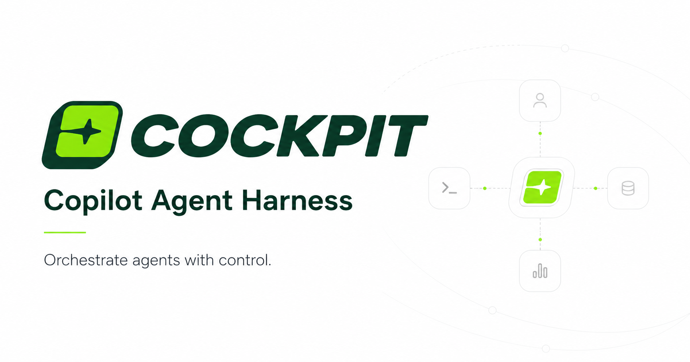
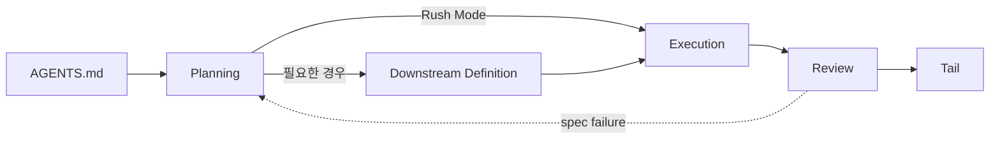

<div align="center">

# Copilot Agent Harness "Cockpit"

VS Code Copilot Chat Agent Mode에서 기획·설계·실행·리뷰를 분리해 운영하는 제품 개발 하네스



</div>

"Cockpit"은 단발성 프롬프트 모음이 아닙니다. `AGENTS.md`, instruction, agent, skill, workflow 문서를 묶어 AI 에이전트가 작업 맥락을 잃지 않게 돕는 구조입니다.

목표는 모든 일을 거대한 프로세스로 강제하는 것이 아닙니다. 작은 작업은 가볍게 처리하고, 기획·설계·리뷰처럼 판단 비용이 큰 작업에서는 필요한 근거와 역할을 먼저 찾게 합니다.

> Last reviewed: 2026-04-27
> Project status: active boilerplate. 이 저장소는 실행 애플리케이션이 아니라 VS Code Copilot Chat Agent Mode를 위한 하네스 템플릿입니다.

---

## 한눈에 보기

- `AGENTS.md`를 시작점으로 삼아 저장소의 철학과 owner map을 고정합니다.
- substantial work 전에는 skill discovery index로 필요한 스킬과 레퍼런스를 찾되, 작은 작업에는 무거운 확인 절차를 강제하지 않습니다.
- Planning, Downstream Definition, Execution, Review, Tail 단계를 나누어 큰 작업의 흐름을 관리합니다.
- Fast, Default, Heavy 모드로 작업 강도를 조절합니다. 작은 변경은 빠르게, 중요한 결정은 council과 evidence gate까지 올립니다.
- Rush Mode와 Fleet Mode를 모두 열어 둡니다. 빠른 구현은 built-in Agent에 맡기고, 큰 실행은 Commander가 계획과 worker dispatch를 관리합니다.
- Coordinator는 단순 리뷰어가 아니라 planning council입니다. PRD의 문제 정의, 범위, metric, downstream readiness를 role-based lane으로 점검합니다.
- `kick-` 스킬은 사용자가 직접 호출하는 집중 워크플로입니다. 리서치, 제품 분석, 디자인 개선처럼 평소보다 강한 조사가 필요할 때 켭니다.
- 컨텍스트를 길게 넘기기보다 `task_packet`으로 필요한 정보만 전달합니다.
- 산출물은 채팅 로그가 아니라 사람이 다시 읽을 수 있는 문서로 남깁니다.

## 누구에게 맞나요

- Copilot Chat을 코드 생성기보다 작업 파트너에 가깝게 쓰고 싶은 사람
- agent, instruction, skill 파일을 처음부터 설계하기보다 검증 가능한 뼈대에서 시작하고 싶은 팀
- 기획, 설계, 구현, 리뷰를 한 대화 안에서 뒤섞지 않고 단계별로 다루고 싶은 프로젝트
- AI 에이전트에게 너무 많은 배경을 던지는 대신 필요한 정보만 넘기는 방식을 선호하는 사용자

## 무엇을 해결하나요

AI 에이전트는 긴 배경을 모두 기억하는 사람이 아닙니다. 세션과 subagent가 바뀔 때마다 필요한 정보만 다시 인수인계해야 합니다. 이 하네스는 그 전제 위에서 작업 흐름을 정리합니다.

| 문제 | 이 저장소의 접근 |
| :--- | :--- |
| 프롬프트와 규칙이 한곳에 쌓임 | `AGENTS.md`는 철학과 owner map만 담고, 세부 규칙은 instructions와 skills로 분리합니다. |
| 모든 작업에 무거운 워크플로우를 강제함 | 작은 작업은 가볍게 처리하고, 큰 결정에만 planning, council, review gate를 엽니다. |
| subagent에게 너무 많은 맥락을 넘김 | `task_packet`으로 목표, 기대 결과, 금지 사항, 근거만 압축합니다. |
| 스킬과 도구가 컨텍스트를 낭비함 | skill index는 위치를 알려주는 discovery surface로 두고, 필요한 순간에만 관련 스킬을 읽게 합니다. |

## 핵심 원칙

### AGENTS.md First

모든 것의 시작은 [AGENTS.md](AGENTS.md)입니다. 이 파일은 항상 보이는 기본 맥락으로서 저장소의 철학, 책임 경계, 최소 owner map만 담습니다. 세부 규칙은 instructions와 skills로 분리합니다.

### Retrieval-Led Reasoning

모델의 기억보다 현재 저장소와 문서를 먼저 봅니다. 필요하면 [skill index](.github/instructions/skill-index.instructions.md), 관련 `SKILL.md`, workflow 문서, 공식 문서 순서로 근거를 좁혀 갑니다.

### Context Frugality

에이전트마다 전체 배경을 다시 넘기지 않습니다. 세션 문서와 `task_packet`은 문제, 기대 결과, 금지 사항, 필요한 근거만 전달합니다.

### Explicit Gates Where They Matter

모든 수정에 PRD를 요구하지 않습니다. 다만 중대한 의사결정, 범위가 큰 구현, 리뷰가 필요한 작업에서는 planning artifact, council review, final review gate를 사용합니다.

### Shallow Delegation

2뎁스 이상의 subagent 호출을 지양합니다. 프롬프트가 에이전트 사이를 지나갈수록 누락되는 맥락이 늘어나기 때문입니다.

### Human-Readable Artifacts

오래 남겨야 할 결정은 사람이 다시 읽을 수 있는 문서로 남깁니다. 대표 산출물은 `prd.md`, `artifacts.md`, `design.md`, `technical.md`, `execution-plan.md`입니다.

## 워크플로우

이 하네스의 전체 흐름은 아래 5단계입니다. 작은 작업은 전체 흐름을 생략할 수 있고, 큰 작업에서만 필요한 단계와 관문을 엽니다.

| Phase | Owner | 주요 산출물 | 다음 단계로 가는 조건 |
| :--- | :--- | :--- | :--- |
| Planning | Mate / Plan | `prd.md`, `artifacts.md` | 요구사항, 범위, 성공 기준이 충분히 정리됨 |
| Downstream Definition | Designer / Architector | `design.md`, `technical.md` | 실행 전 필요한 UI/UX 또는 기술 판단이 준비됨 |
| Execution | Rush: built-in Agent / Fleet: Commander -> Deep Execution Agent | 구현 코드, `execution-plan.md`, 검증 결과 | 구현 결과와 verification evidence 확보 |
| Review | Reviewer | role-based findings, final verdict | 승인 가능한 수준의 review verdict |
| Tail | 현재 owner | git 정리, memory 정리 | 리뷰 이후 필요한 후속 정리 완료 |



자세한 흐름은 [WORKFLOW-PLAYBOOK.md](docs/workflow/WORKFLOW-PLAYBOOK.md), [PLANNING-WORKFLOW.md](docs/workflow/PLANNING-WORKFLOW.md), [EXECUTION-WORKFLOW.md](docs/workflow/EXECUTION-WORKFLOW.md)를 참고하세요.

## 작업 강도 모드

같은 Planning이라도 모든 요청에 같은 무게를 걸지 않습니다. Mate는 작업의 모호함, 위험도, 근거 필요성에 따라 Fast, Default, Heavy 중 하나의 흐름을 사용합니다.

| Mode | 쓰는 시점 | 핵심 동작 |
| :--- | :--- | :--- |
| Fast | 범위가 작고 의사결정 비용이 낮은 작업 | Plan-style `prd.md`를 빠르게 만들고, council과 downstream 자동 호출은 생략합니다. |
| Default | 일반적인 제품 기능, 문서, UI/UX 작업 | PRD를 작성한 뒤 Coordinator council로 품질을 확인하고, 필요한 Designer/Architector lane을 엽니다. |
| Heavy | 모호하거나 영향이 큰 결정, 근거가 중요한 작업 | 더 깊은 digging, 더 높은 quality gate, post-design/technical review까지 사용해 evidence gap을 닫습니다. |

이 모드 구조의 목적은 프로세스를 늘리는 것이 아니라 작업 크기에 맞는 마찰만 남기는 것입니다. 작을 때는 빠르게 지나가고, 큰 결정에서는 천천히 잠급니다.

## 포함된 Agent

### Core Agents

| Agent | 파일 | 역할 |
| :--- | :--- | :--- |
| Mate | [.github/agents/Mate.agent.md](.github/agents/Mate.agent.md) | 사용자 요청을 PRD와 artifact index로 정리하고 downstream handoff를 엽니다. |
| Plan | [.github/agents/Plan.agent.md](.github/agents/Plan.agent.md) | 구현 전 조사와 실행 계획을 작성하는 가벼운 planning agent입니다. |
| Designer | [.github/agents/Designer.agent.md](.github/agents/Designer.agent.md) | 승인된 PRD를 UI/UX 설계 문서로 확장합니다. |
| Architector | [.github/agents/Architector.agent.md](.github/agents/Architector.agent.md) | 승인된 PRD를 기술 설계와 통합 경계로 확장합니다. |
| Commander | [.github/agents/Commander.agent.md](.github/agents/Commander.agent.md) | Fleet Mode에서 실행 계획, worker dispatch, review strategy를 관리합니다. |
| Deep Execution Agent | [.github/agents/Deep-execution.agent.md](.github/agents/Deep-execution.agent.md) | 스코프가 잠긴 구현과 자체 검증을 수행합니다. |
| Reviewer | [.github/agents/Reviewer.agent.md](.github/agents/Reviewer.agent.md) | 코드 품질, 보안, 성능, 런타임, final-review gate를 검토합니다. |

### Support Agents

| Agent | 파일 | 쓰는 시점 |
| :--- | :--- | :--- |
| Explore | [.github/agents/Explore.agent.md](.github/agents/Explore.agent.md) | 로컬 코드베이스 근거, 재사용 패턴, project-specific rule을 찾을 때 |
| Librarian | [.github/agents/Librarian.agent.md](.github/agents/Librarian.agent.md) | 공식 문서, 외부 레퍼런스, 최신 API 동작을 확인할 때 |
| Coordinator | [.github/agents/Coordinator.agent.md](.github/agents/Coordinator.agent.md) | 중대한 의사결정이나 PRD 품질을 role-based council로 검토할 때 |
| Painter | [.github/agents/Painter.agent.md](.github/agents/Painter.agent.md) | design context를 바탕으로 웹용 비주얼 에셋을 만들 때 |

### Coordinator Council

Coordinator는 Reviewer의 다른 이름이 아닙니다. Reviewer가 구현 결과의 결함을 찾는 마지막 판정자라면, Coordinator는 구현 전에 방향이 맞는지 확인하는 planning council입니다.

- `manager`, `product`, `execution` 같은 역할 관점으로 PRD를 나누어 읽습니다.
- 문제 정의, 사용자 적합성, scope discipline, success metric, requirement quality, downstream seed를 점수화합니다.
- green/yellow/red verdict와 required changes를 반환해 Mate가 PRD를 다시 다듬게 합니다.
- 필요할 때만 Explore나 Librarian를 붙여 local evidence 또는 외부 근거를 보강합니다.

그래서 Coordinator의 가치는 “리뷰를 더 한다”가 아니라 “잘못된 일을 더 잘 구현하기 전에 멈춘다”에 가깝습니다.

## Skill System

스킬은 에이전트가 특정 도메인의 판단 기준을 찾는 discovery surface입니다. 이 저장소는 "무조건 이 스킬을 써라"보다 "필요한 스킬을 여기서 찾는다"는 구조를 택합니다.

| Category | 대표 스킬 |
| :--- | :--- |
| Writing & content | `writing-readme`, `writing-clearly`, `writing-document`, `research-content-source` |
| Design & UX | `ds-product-ux`, `ds-ui-patterns`, `ds-typography`, `ds-visual-design`, `ds-anti-ai-slop`, `ds-visual-review`, `research-design` |
| Web visuals | `ds-image-gen` |
| Frontend engineering | `fe-react-patterns`, `fe-a11y`, `fe-tailwindcss`, `fe-code-review`, `fe-zustand`, `fe-tanstack-query`, `fe-ai-elements` |
| Security & backend | `dev-security`, `be-api-design`, `fastify-best-practices`, `be-prisma`, `be-drizzle`, `be-kysely` |
| SEO | `seo-technical`, `seo-content` |
| Workflow & tooling | `agent-browser`, `git-workflow`, `gh-cli`, `dev-vite`, `dev-turbopack`, `pdf`, `research-foundation` |
| Memory & context | `memory-synthesizer` |

전체 discovery 기준은 [.github/instructions/skill-index.instructions.md](.github/instructions/skill-index.instructions.md), 실제 스킬 본문은 [.github/skills/](.github/skills/)에서 확인할 수 있습니다.

### Kick Skills

`kick-` 접두사 스킬은 사용자가 직접 호출하는 상위 워크플로우입니다. 에이전트가 자동으로 실행하지 않는다는 점이 일반 스킬과 다릅니다.

| Skill | 목적 |
| :--- | :--- |
| `kick-analyze` | 제품을 시장, 경쟁, UX, 전략 관점에서 분석하고 실행 가능한 추천으로 합성합니다. |
| `kick-research` | 특정 주제를 lane 단위로 나누어 깊게 조사하고, decision-ready evidence를 만듭니다. |
| `kick-init` | 프로젝트 디자인 컨텍스트를 처음 수집해 이후 디자인·프론트엔드 스킬의 기준점을 만듭니다. |
| `kick-design-booster` | UI를 진단한 뒤 simplify, harden, polish, delight 같은 개선 워크플로를 조합합니다. |

일반 스킬이 “작업 중 필요한 판단 기준”이라면 kick 스킬은 “지금부터 이 문제를 강하게 파고들자”는 사용자 의사 표시입니다. 자동 호출하지 않기 때문에 평소 흐름은 가볍고, 필요할 때만 분석 강도를 크게 올릴 수 있습니다.

## 디렉터리 구조

```text
.
├── AGENTS.md
├── README.md
├── LICENSE.md
├── docs/
│   ├── AGENT-SYSTEM-GUIDE.md
│   ├── AGENTS.md
│   └── workflow/
├── plans/
├── public/
│   ├── cover.png
│   ├── favicon.svg
│   ├── index.html
│   ├── logo-dark.png
│   └── logo-light.png
├── .github/
│   ├── agents/
│   ├── hooks/
│   ├── instructions/
│   ├── memories/
│   └── skills/
└── .agents/
```

## 문서 지도

| 문서 | 역할 |
| :--- | :--- |
| [AGENTS.md](AGENTS.md) | 항상 보이는 저장소 철학과 owner map |
| [docs/AGENT-SYSTEM-GUIDE.md](docs/AGENT-SYSTEM-GUIDE.md) | `.github/` 영역을 유지보수할 때 보는 시스템 안내서 |
| [docs/workflow/WORKFLOW-PLAYBOOK.md](docs/workflow/WORKFLOW-PLAYBOOK.md) | Planning부터 Tail까지의 전체 흐름 |
| [.github/instructions/subagent-invocation.instructions.md](.github/instructions/subagent-invocation.instructions.md) | subagent 호출 packet schema와 선택 기준 |
| [.github/instructions/skill-index.instructions.md](.github/instructions/skill-index.instructions.md) | 작업별 skill discovery registry |
| [.github/agents/artifacts/](.github/agents/artifacts/) | PRD, design, technical, execution plan 템플릿 |
| [.github/memories/memories.md](.github/memories/memories.md) | 프로젝트 memory 경로와 오래 남길 사실 관리 기준 |
| [public/index.html](public/index.html) | 하네스 소개용 정적 페이지 |

## 빠르게 시작하기

### 사전 요구사항

- [VS Code](https://code.visualstudio.com/)
- [Git](https://git-scm.com/)
- [GitHub Copilot](https://marketplace.visualstudio.com/items?itemName=GitHub.copilot)
- [GitHub Copilot Chat](https://marketplace.visualstudio.com/items?itemName=GitHub.copilot-chat)

### 저장소 확인

```bash
git clone https://github.com/Conradmaker/copilot-cockpit.git
cd copilot-cockpit
code .
```

이 저장소는 런타임 서버가 필요하지 않습니다. 실제 시작점은 `.github/`, `AGENTS.md`, `docs/`에 있는 에이전트 하네스 문서입니다. 소개용 정적 페이지는 [public/index.html](public/index.html)에서 확인할 수 있습니다.

### 첫 요청 예시

- "Mate로 새 기능 PRD를 만들어줘."
- "Plan 모드로 구현 계획만 먼저 정리해줘."
- "이 PRD에서 design.md가 필요한지 판단하고 Designer를 열어줘."
- "Fleet Mode로 execution plan부터 잡고 구현까지 진행해줘."
- "이번 변경을 security reviewer 관점에서 검토해줘."

## 내 프로젝트에 가져가기

가장 작은 권장 복사 단위는 아래와 같습니다.

```text
AGENTS.md
.github/agents/
.github/instructions/
.github/skills/
docs/workflow/
```

`.github/agents/`에는 agent 정의와 artifact 템플릿이 함께 들어 있습니다. 둘을 분리해 복사하면 Mate, Commander, Designer, Architector의 계약이 깨질 수 있습니다.

상황에 따라 아래 항목을 추가로 가져갑니다.

| 항목 | 가져갈 때 |
| :--- | :--- |
| [.github/memories/](.github/memories/) | 프로젝트 memory convention까지 맞추고 싶을 때 |
| [.github/hooks/](.github/hooks/) | `SubagentStop` 포맷팅 같은 자동화를 쓰고 싶을 때 |
| [docs/AGENT-SYSTEM-GUIDE.md](docs/AGENT-SYSTEM-GUIDE.md) | 하네스 유지보수자를 위한 안내서가 필요할 때 |
| [public/](public/) | 하네스 소개용 정적 페이지와 로고 에셋이 필요할 때 |

복사한 뒤에는 [AGENTS.md](AGENTS.md)를 대상 프로젝트에 맞게 줄이고, [.github/instructions/skill-index.instructions.md](.github/instructions/skill-index.instructions.md)에서 실제로 쓸 skill category만 남기는 편이 좋습니다.

## 커스터마이징

### Agent 추가 또는 수정

새 agent는 `.github/agents/` 아래에 `.agent.md`로 추가합니다.

```text
.github/agents/MyAgent.agent.md
```

작성 규칙은 [.github/instructions/create-agent.instructions.md](.github/instructions/create-agent.instructions.md)를 참고하세요.

### Skill 추가 또는 수정

새 skill은 `.github/skills/<skill-name>/SKILL.md` 형태로 추가합니다.

```text
.github/skills/my-skill/SKILL.md
```

작성 규칙은 [.github/instructions/create-skills.instructions.md](.github/instructions/create-skills.instructions.md)를 참고하세요. 카테고리나 대표 trigger를 바꾸면 [.github/instructions/skill-index.instructions.md](.github/instructions/skill-index.instructions.md)도 함께 갱신합니다.

### Workflow 조정

workflow의 기준 문서는 아래 위치에 나뉘어 있습니다.

- 사용자용 흐름: [docs/workflow/WORKFLOW-PLAYBOOK.md](docs/workflow/WORKFLOW-PLAYBOOK.md)
- subagent 호출 계약: [.github/instructions/subagent-invocation.instructions.md](.github/instructions/subagent-invocation.instructions.md)
- agent별 receiver contract: [.github/agents/](.github/agents/)
- Mate mode별 세부 흐름: [.github/agents/workflows/](.github/agents/workflows/)

### Hook과 MCP

이 하네스는 MCP와 hook 자동화를 작게 유지하는 쪽을 권장합니다. 현재 hook 예시는 [.github/hooks/format.json](.github/hooks/format.json)의 `SubagentStop` 포맷팅입니다. 강제 skill 로딩이나 과한 자동화는 컨텍스트를 낭비할 수 있으므로 팀이 감당할 수 있는 수준만 남기세요.

## 주의할 점

- `chat.subagents.allowInvocationsFromSubagents`를 켜면 subagent가 다른 subagent를 호출할 수 있습니다. 이 하네스는 기본적으로 2뎁스 이상의 호출을 지양합니다.
- README의 예시는 시작점입니다. 대상 프로젝트에 복사한 뒤에는 불필요한 agent, skill, workflow를 줄여야 합니다.
- 이 저장소는 애플리케이션 보일러플레이트가 아니라 에이전트 작업 보일러플레이트입니다. `npm install`이나 서버 실행 절차가 중심이 아닙니다.

## 기여하기

문서, agent, skill, workflow 모두 기여 대상입니다.

1. 변경하려는 영역의 owner 문서를 먼저 확인합니다.
2. 관련 instruction 또는 skill 작성 규칙을 읽습니다.
3. 변경 후 README, docs, agent contract가 서로 충돌하지 않는지 확인합니다.
4. 필요한 경우 PR에서 어떤 판단 기준을 바꿨는지 설명합니다.

## License

[Apache License 2.0](LICENSE.md)
