# Execution 워크플로

이 문서는 Execution 단계에서 쓰는 Fleet Mode 흐름을 다이어그램 중심으로 설명한다. Rush Mode는 Commander orchestration 대신 built-in `Agent`의 자율 구현·검증 능력을 신뢰하는 direct path라 상위 개념은 [WORKFLOW-PLAYBOOK.md](WORKFLOW-PLAYBOOK.md)에서 본다.

상위 개념과 phase 전체 규칙은 [WORKFLOW-PLAYBOOK.md](WORKFLOW-PLAYBOOK.md)에서 본다.

## 이 문서가 필요한 때

- Execution 진입 관문을 한눈에 파악하고 싶을 때
- Commander 오케스트레이션, worker dispatch, Review 반복을 시각적으로 확인하고 싶을 때
- Fleet Mode와 Rush Mode의 역할 경계를 확인하고 싶을 때
- 실행 계획, 검토 전략, Tail 판단이 어떤 순서로 이어지는지 확인하고 싶을 때

## Execution 흐름

```mermaid
flowchart TD
    Start(["Execution 시작 요청"])
    Gate{"진입 조건이 준비됐는가"}
    Escalate["Execution 진입 중단<br/>누락 산출물, 사용자 승인,<br/>Planning 또는 downstream 보완 요청"]
    Summary(["오케스트레이션 요약 반환<br/>진행률과 남은 리스크 정리"])

    subgraph Commander["Commander 오케스트레이션"]
        Load["먼저 artifacts.md를 읽고,<br/>listed된 execution brief 또는 승인된 PRD,<br/>downstream 문서를 읽음"]
        Scope["범위 점검 수행<br/>single plan 또는 split plans 판단"]
        Research{"추가 근거가 필요한가"}
        Augment["Explore 또는 Librarian 호출<br/>근거를 합성해 반영"]
        Map["file structure map 작성"]
        Plan["EXECUTION-PLAN-TEMPLATE.md 기준<br/>실행 계획 작성"]
        AssetNeed{"asset generation phase가 필요한가"}
        AssetPlan["Painter용 asset generation phase 추가"]
        Todo["todo 생성 또는 갱신<br/>검토 전략 기록"]
        CoordPlan["Coordinator execution review"]
        Gotchas["gotcha와 risk 식별<br/>필요하면 plan 갱신"]
        Blocker{"치명적 차단 요소,<br/>범위 확장,<br/>사용자 선택 필요 여부"}
        Ready{"dispatch 가능한 task가 있는가"}
        Brief["구현/asset brief 합성<br/>files, scope, done-definition, verification 잠금<br/>packet-only digest로 압축"]
        Dispatch["dependency wave 단위로 dispatch<br/>code task는 Deep Execution Agent,<br/>asset task는 Painter에 전달"]
        Evidence["검증 근거 회수<br/>commands, results, paths 정리"]
        Sync["worker 결과 합성<br/>todo와 execution-plan.md 갱신"]
        Drift{"drift 또는 확신 저하가 있는가"}
        CoordMid["필요할 때 Coordinator<br/>role-based review"]
        More{"남은 task가 있는가"}
        RefreshReview["변경된 영역과 verification evidence를 기준으로<br/>검토 전략 갱신"]
        ReviewSynthesis["role review 결과, verification evidence,<br/>residual risk를 종합해<br/>final-review packet 준비"]
        Reopen["invalidated task나 wave만 다시 열고<br/>todo와 execution-plan.md 갱신"]
        GitNeed{"Git Tail이 필요한가"}
        GitTail["Commander가 Git Tail을 결정하고<br/>실제 git 작업은 Deep Execution Agent가 수행"]
        MemoryNeed{"Memory Tail이 필요한가"}
        MemoryTail["Commander가 Memory Tail 수행<br/>durable signal만 저장"]
    end

    subgraph Worker["Deep Execution Agent"]
        Implement["독립 code task를 병렬 wave로 수행하고<br/>각 task에서 필수 verification 수행"]
    end

    subgraph Asset["Painter"]
        Generate["필요한 asset task를 병렬로 읽고<br/>asset item을 생성"]
    end

    subgraph Review["Reviewer 검토 흐름"]
        ReviewWave["필요한 Reviewer role을 병렬로 호출<br/>각 packet은 changed surface와 evidence digest를 포함"]
        FinalReview["마지막 Reviewer final-review 관문"]
        Verdict{"final-review verdict"}
    end

    Start --> Gate
    Gate -- "아니오" --> Escalate --> Summary
    Gate -- "예" --> Load --> Scope --> Research
    Research -- "예" --> Augment --> Map
    Research -- "아니오" --> Map
    Map --> Plan --> AssetNeed
    AssetNeed -- "예" --> AssetPlan --> Todo
    AssetNeed -- "아니오" --> Todo
    Todo --> Gotchas --> CoordPlan --> Blocker
    Blocker -- "예" --> Escalate
    Blocker -- "아니오" --> Ready
    Ready -- "예" --> Brief --> Dispatch
    Dispatch --> Implement --> Evidence
    Dispatch --> Generate --> Evidence
    Evidence --> Sync --> Drift
    Drift -- "예" --> CoordMid --> More
    Drift -- "아니오" --> More
    More -- "예" --> Ready
    More -- "아니오" --> RefreshReview --> ReviewWave
    ReviewWave --> ReviewSynthesis --> FinalReview --> Verdict
    Verdict -- "rework-required" --> Reopen --> Ready
    Verdict -- "approve" --> GitNeed
    Verdict -- "approve-with-risks" --> GitNeed
    GitNeed -- "예" --> GitTail --> MemoryNeed
    GitNeed -- "아니오" --> MemoryNeed
    MemoryNeed -- "예" --> MemoryTail --> Summary
    MemoryNeed -- "아니오" --> Summary
```

## Execution entry

| 경로 | 설명 |
| --- | --- |
| Fleet Mode | Commander가 `artifacts.md`와 `EXECUTION-PLAN-TEMPLATE.md`를 기준으로 실행 계획을 만들고, Deep Execution Agent와 Reviewer를 오케스트레이션한다. |
| Rush Mode | Mate가 built-in `Agent`로 직접 handoff한다. Commander orchestration 대신 먼저 `artifacts.md`와 listed된 relevant artifacts를 requirement surface로 읽고 구현, 검증, 후속 조치를 직접 수행하는 direct path다. 다만 artifact 충돌이나 evidence gap은 최소 안전 장치로 드러내고 보완 또는 escalation한다. 이 문서의 다이어그램 범위 밖이다. |

## 읽는 법

- 진입 관문이 실패하면 Execution에 들어가지 않고, 산출물 보강, 사용자 승인 확보, Planning 또는 downstream 보완으로 되돌아간다.
- 이 문서는 Fleet Mode를 설명한다. Rush Mode는 Commander orchestration이 아니라 built-in `Agent` direct path라 상위 playbook에서만 짧게 다룬다.
- Rush Mode에서도 먼저 `artifacts.md`를 읽고, listed된 relevant artifacts를 requirement surface로 해석한다. 다만 artifact 충돌이나 evidence gap은 덮지 않고 드러낸 뒤 필요한 보강이나 escalation을 남긴다.
- Commander는 먼저 `artifacts.md`를 읽고, listed된 execution brief가 있으면 그것을 우선 읽는다. execution brief가 없으면 listed된 approved PRD와 downstream 문서를 읽는다. 그다음 `EXECUTION-PLAN-TEMPLATE.md`를 기준으로 실행 계획을 정리한 뒤 worker dispatch에서는 packet-only brief로 다시 압축한다.
- exact evidence field definition과 completeness 기준은 Deep Execution Agent의 `Verification`, Reviewer의 `Evidence`, `Risks`가 담당하고, 이 문서는 흐름만 요약한다.
- plan을 만든 뒤에는 Coordinator `execution` review를 기본 관문으로 거친다. 이 단계는 선택형이 아니라 execution plan 품질을 맞추는 기본 흐름이다.
- dispatch 전에는 최신 findings를 구현 준비가 된 brief로 합성하고, raw worker findings를 그대로 다음 worker에게 넘기지 않는다. implementation task와 review task 모두 generic artifact bag 없이 packet만으로 시작할 수 있어야 한다.
- code task는 dependency wave를 기준으로 Deep Execution Agent에 배분하고, 독립 task는 병렬로 돌릴 수 있다. generated image asset가 필요한 경우 asset task는 Painter에 배분한다.
- worker 결과는 pass/fail 한 줄이 아니라 changed files, commands, observed results, skipped checks를 포함한 evidence로 회수한다.
- 구현 중 drift가 감지되면 Coordinator review를 중간에 다시 열 수 있다.
- wrong-approach retry는 fresh worker가 기본이고, local error-context correction은 continue가 기본이다.
- review 단계에서는 role review를 병렬 wave로 열 수 있고, 그 결과는 Commander가 lane findings, verification evidence, residual risk로 종합한 뒤 `final-review` packet에 반영한다.
- `final-review`가 `rework-required`를 내리면 Commander는 전체를 처음부터 다시 돌리지 않고 invalidated task나 wave만 다시 열어 재구현과 재검토를 이어 간다.
- 구현이 끝나면 review 전략에 맞는 검토를 거친 뒤 `final-review` 관문으로 최종 verdict를 닫는다. review packet은 changed surface와 evidence digest가 빠지면 안 된다.
- `final-review` verdict가 승인 가능 수준일 때만 Git Tail과 Memory Tail 판단으로 넘어간다.