# Planning 워크플로

이 문서는 Planning 단계의 공통 반복 흐름과 Mate의 mode 분기를 다이어그램 중심으로 설명한다.

상위 개념과 phase 전체 규칙은 [WORKFLOW-PLAYBOOK.md](WORKFLOW-PLAYBOOK.md)에서 본다.

## 이 문서가 필요한 때

- Planning 진입, Discovery, Council, Approval 흐름을 한눈에 보고 싶을 때
- Mate, Explore, Librarian, Coordinator가 어디서 어떻게 역할을 나누는지 시각적으로 확인하고 싶을 때
- default mode, fast mode, heavy mode가 어디서 갈라지고 무엇이 달라지는지 확인하고 싶을 때

이 문서의 다이어그램은 strict linear script가 아니라 checkpoint map이다.
Alignment, Discovery, Draft Sync는 현재 draft와 evidence 상태에 따라 필요할 때마다 다시 왕복할 수 있다.

## Planning 흐름

```mermaid
flowchart TD
    Start(["Planning 시작 요청"])
    Entry["사용자 요청과 현재 session 산출물 확인"]
    Mode{"mode가 명시돼 있는가"}
    ExplicitMode{"명시된 mode는 무엇인가"}
    SelectMode["askQuestions로 default, fast 또는 heavy 선택"]
    SelectedMode{"선택된 mode는 무엇인가"}
    DefaultMode["default mode 시작"]
    FastMode["fast mode 시작"]
    HeavyMode["heavy mode 시작"]
    ActiveMode{"현재 Planning mode"}

    subgraph Shared["공통 Planning 반복 흐름"]
        Discover["가까운 skill, reference,<br/>재사용 패턴, 프로젝트 규칙 확인"]
        Clarify{"문제 정의, 사용자, 범위,<br/>metric, non-goal이 흐린가"}
        Ask["askQuestions로 정렬 질문 수행"]
        Evidence{"맥락 공백, 근거 공백,<br/>reference 필요가 있는가"}
        ExploreLane["Explore로 로컬 근거 수집"]
        LibrarianLane["Librarian로 외부 근거 수집"]
        ReferenceSync["결정 가능한 근거를<br/>prd.md에 반영하고<br/>artifacts.md를 동기화"]
        Ears["EARS 다차원 점검<br/>functional, visual-design, UX, technical, content"]
        Draft["default/heavy는 PRD-TEMPLATE,<br/>fast는 Plan-style PRD 기준으로<br/>prd.md 작성"]
        ReviewRoute{"현재 Planning mode"}
        Council["Coordinator 관점 최소 2개를<br/>동시에 병렬로 열기<br/>role별 검토와 PRD score 수행"]
        Verdict{"Coordinator verdict"}
        Refine["prd.md와 artifacts.md를 고치고<br/>필요한 관점만 다시 연다"]
        Gate["Coordinator Scores와 PRD Quality Gate로<br/>Planning 품질 관문 평가"]
        Pass{"품질 관문 통과 여부"}
        Brief["정리된 PRD 요약 안내"]
    end

    subgraph Default["Default Mode 분기"]
        DefaultDecision["Mate가 downstream mode를 결정"]
        DefaultModePick{"downstream mode"}
        DefaultDesign["Designer 호출"]
        DefaultTechPrep{"technical seed가 충분한가"}
        DefaultResearch["추가 조사 또는 확인 질문 재개"]
        DefaultTech["Architector 호출"]
        DefaultBothDesign["Designer를 먼저 호출하고<br/>design output 확인"]
        DefaultSync["최신 승인 산출물 동기화 후 종료"]
    end

    subgraph Fast["Fast Mode 분기"]
        FastGate["정성 readiness gate 평가"]
        FastPass{"핵심 범위, 제약, 검증이<br/>handoff 가능 수준인가"}
        FastBrief["정리된 Plan-style PRD 요약 안내"]
        FastHandoff{"사용자가 Fleet 또는 Rush 선택"}
        FastFleet["Fleet handoff 준비"]
        FastRush["Rush handoff 준비"]
    end

    subgraph Heavy["Heavy Mode 분기"]
        HeavyDecision["Mate가 downstream mode를 직접 결정"]
        HeavyModePick{"결정된 mode"}
        HeavyDesign["Designer를 먼저 호출"]
        PostDesign["생성된 design.md를<br/>PRD, references, Coordinator findings 기준으로 재검토"]
        HeavyDesignOk{"design 흐름이 유효한가"}
        HeavyTechNeed{"technical 흐름이 정말 필요한가"}
        HeavyTechPrep{"technical seed가 충분한가"}
        HeavyResearch["추가 조사 또는 확인 질문 재개"]
        HeavyTech["Architector 호출"]
        PostTech["생성된 technical.md를<br/>PRD, references, 승인된 design 기준으로 재검토"]
        HeavyTechOk{"technical 흐름이 유효한가"}
        HeavySync["최신 승인 산출물 동기화 후 종료"]
    end

    End(["Planning 종료 또는 downstream 인계 준비"])

    Start --> Entry --> Mode
    Mode -- "예" --> ExplicitMode
    Mode -- "아니오" --> SelectMode --> SelectedMode
    ExplicitMode -- "default" --> DefaultMode
    ExplicitMode -- "fast" --> FastMode
    ExplicitMode -- "heavy" --> HeavyMode
    SelectedMode -- "default" --> DefaultMode
    SelectedMode -- "fast" --> FastMode
    SelectedMode -- "heavy" --> HeavyMode

    DefaultMode --> Discover
    FastMode --> Discover
    HeavyMode --> Discover
    Discover --> Clarify
    Clarify -- "예" --> Ask --> Evidence
    Clarify -- "아니오" --> Evidence
    Evidence -- "예" --> ExploreLane --> ReferenceSync
    Evidence -- "외부 근거 병렬 필요" --> LibrarianLane --> ReferenceSync
    Evidence -- "아니오" --> Ears
    ReferenceSync --> Ears --> Draft --> ReviewRoute
    ReviewRoute -- "fast" --> FastGate
    ReviewRoute -- "default/heavy" --> Council
    FastGate --> FastPass
    FastPass -- "통과" --> FastBrief --> FastHandoff
    FastPass -- "미통과" --> Refine --> Discover
    FastHandoff -- "Fleet" --> FastFleet --> End
    FastHandoff -- "Rush" --> FastRush --> End
    Council --> Verdict
    Verdict -- "green" --> Gate
    Verdict -- "yellow" --> Refine --> Discover
    Verdict -- "red" --> Refine --> Discover
    Gate --> Pass
    Pass -- "통과" --> Brief
    Pass -- "미통과" --> Refine --> Discover

    Brief --> ActiveMode
    ActiveMode -- "default" --> DefaultDecision
    ActiveMode -- "heavy" --> HeavyDecision

    DefaultDecision --> DefaultModePick
    DefaultModePick -- "디자인만" --> DefaultDesign --> DefaultSync --> End
    DefaultModePick -- "기술설계만" --> DefaultTechPrep
    DefaultTechPrep -- "예" --> DefaultTech --> DefaultSync --> End
    DefaultTechPrep -- "아니오" --> DefaultResearch --> DefaultTech
    DefaultModePick -- "둘 다" --> DefaultBothDesign --> DefaultTechPrep

    HeavyDecision --> HeavyModePick
    HeavyModePick -- "디자인만" --> HeavyDesign --> PostDesign --> HeavyDesignOk
    HeavyModePick -- "기술설계만" --> HeavyTechPrep
    HeavyModePick -- "둘 다" --> HeavyDesign --> PostDesign --> HeavyDesignOk
    HeavyDesignOk -- "아니오" --> Refine
    HeavyDesignOk -- "예" --> HeavyTechNeed
    HeavyTechNeed -- "아니오" --> HeavySync --> End
    HeavyTechNeed -- "예" --> HeavyTechPrep
    HeavyTechPrep -- "예" --> HeavyTech --> PostTech --> HeavyTechOk
    HeavyTechPrep -- "아니오" --> HeavyResearch --> HeavyTech
    HeavyTechOk -- "아니오" --> Refine
    HeavyTechOk -- "예" --> HeavySync --> End
```

## Mode 차이 핵심

| 항목 | default | fast | heavy |
| --- | --- | --- | --- |
| mode 결정 | 사용자가 명시하거나 askQuestions로 선택 | 사용자가 명시하거나 askQuestions로 선택 | 사용자가 명시하거나 askQuestions로 선택 |
| 조사 강도 | 필요한 범위까지만 탐색 | handoff 가능한 핵심 evidence 중심의 최소 조사 | 근거를 닫기 위한 깊은 조사 |
| Coordinator 기준 | Coordinator 관점 최소 2개, 관문 통과와 PRD score 산출 중심 | Council 없이 진행하고, 필요할 때만 보강 검토를 연다 | Coordinator 관점 최소 2개, 열린 관점 모두 green과 PRD score 산출 필요 |
| Planning 품질 관문 | Coordinator Scores와 PRD Quality Gate total 88 이상, 치명적 차단 요소 없음, downstream auto-decision을 열 수 있을 만큼 PRD가 정리되어 있어야 함 | 정성 readiness gate. Plan-style PRD에 핵심 문제, 범위, 제약, verification이 handoff 가능 수준으로 정리돼 있어야 함 | Coordinator Scores와 PRD Quality Gate total 95 이상, 열린 관점 모두 green, evidence gap이 관리 가능한 범위여야 함 |
| downstream mode 결정 | Mate가 current PRD와 coordinator signal을 바탕으로 자동 결정 | 사용자가 Fleet 또는 Rush를 직접 선택 | Mate가 current PRD와 coordinator signal을 바탕으로 자동 결정 |
| downstream 순서 | `둘 다`에서는 Designer를 먼저 열고 design output 확인 뒤 Architector를 연다 | downstream auto-decision 없이 user-selected Fleet 또는 Rush handoff로 바로 이어진다 | design-first review 뒤 technical 진입 필요 여부를 다시 판단할 수 있다 |

## 읽는 법

- Planning은 항상 Mate가 주 담당이고, Explore, Librarian, Coordinator는 보조 역할로 붙는다.
- 공통 반복은 질문, Discovery, Draft Sync, 그리고 mode에 맞는 review 또는 readiness gate를 checkpoint 중심으로 돈다.
- fast mode에서는 Council과 downstream auto-decision 없이 Plan-style PRD를 정리하고, 정성 readiness gate를 통과하면 사용자가 Fleet 또는 Rush를 직접 선택한다.
- default mode에서는 정리된 PRD 요약 안내와 Mate의 downstream auto-decision이 Planning 종료 직전의 중요한 관문이다. `둘 다` downstream은 Designer를 먼저 완료한 뒤 Architector로 이어진다.
- heavy mode에서는 조사 강도와 Council 기준이 더 강하고, downstream 흐름도 먼저 디자인을 거치는 순서로 다시 검토한다.
- 세 mode 모두 승인된 PRD가 준비되기 전에는 Execution으로 넘어가지 않는다.

## 산출물

- `prd.md`
- `artifacts.md`
- 정리된 PRD 요약 안내
- fast mode면 user-selected Fleet 또는 Rush 인계
- default 또는 heavy에서 인계가 열리면 최신 `artifacts.md`와 함께 이어지는 안내형 인계
- default 또는 heavy에서 필요하면 `design.md` 또는 `technical.md`로 이어지는 안내형 인계
